# 🏗️ AI Chatbot - Architecture & Flow Diagrams

## System Architecture Diagram

## Data Flow - Complete Message Processing

## Session Isolation Architecture

```mermaid
graph LR
    Browser1["🌐 Browser 1<br/>Session A"]
    Browser2["🌐 Browser 2<br/>Session B"]
    Browser3["🌐 Browser 3<br/>Session C"]
    
    App["Streamlit App<br/>Single Instance"]
    
    SessionA["Session State A<br/>thread_id: UUID1<br/>messages: [...]"]
    SessionB["Session State B<br/>thread_id: UUID2<br/>messages: [...]"]
    SessionC["Session State C<br/>thread_id: UUID3<br/>messages: [...]"]
    
    DB["SQLite Database<br/>All threads stored"]
    
    Browser1 -->|creates| SessionA
    Browser2 -->|creates| SessionB
    Browser3 -->|creates| SessionC
    
    SessionA -->|persists via| DB
    SessionB -->|persists via| DB
    SessionC -->|persists via| DB
    
    SessionA -.->|NO ACCESS| SessionB
    SessionB -.->|NO ACCESS| SessionC
    SessionA -.->|NO ACCESS| SessionC
    
    style SessionA fill:#c8e6c9
    style SessionB fill:#bbdefb
    style SessionC fill:#ffe0b2
    style DB fill:#f0f4c3
```

## LangGraph State Management Flow

## Database Schema & Relationships

## Request/Response Lifecycle

## Component Interaction Matrix

```mermaid
graph TB
    subgraph Frontend["🎨 Frontend Layer"]
        SF["Streamlit App"]
        UI["Chat UI"]
        SB["Sidebar"]
        CSS["Custom CSS"]
    end
    
    subgraph Application["⚙️ Application Layer"]
        LG["LangGraph"]
        CS["ChatState"]
        SG["StateGraph"]
        CN["ChatNode"]
    end
    
    subgraph LLMLayer["🚀 LLM Layer"]
        GA["Groq API"]
        MODEL["Llama 3.3 70B"]
    end
    
    subgraph Persistence["💾 Persistence Layer"]
        CP["Checkpointer"]
        DB[(SQLite DB)]
        FILES["chatbot.db file"]
    end
    
    SF --> UI
    SF --> SB
    UI --> CSS
    SB --> CSS
    
    SF --> LG
    LG --> CS
    LG --> SG
    SG --> CN
    
    CN --> GA
    GA --> MODEL
    MODEL --> GA
    
    CN --> CP
    CP --> DB
    DB --> FILES
    
    SG --> CP
    CP --> SF
    
    style Frontend fill:#fff3e0
    style Application fill:#e8f5e9
    style LLMLayer fill:#fff9c4
    style Persistence fill:#f1f8e9
```

## Deployment Architecture (Render)

```mermaid
graph TB
    Client["🌐 Users<br/>Web Browser"]
    CDN["⚡ Render CDN"]
    RenderWeb["☁️ Render Web Service<br/>Python 3.13"]
    
    RenderApp["📦 Application Container<br/>Streamlit + Dependencies"]
    
    GroqAPI["🚀 Groq API<br/>(External)"]
    
    RenderFS["📁 File System<br/>chatbot.db"]
    
    Client -->|HTTPS| CDN
    CDN -->|routes to| RenderWeb
    RenderWeb --> RenderApp
    RenderApp -->|load code| RenderFS
    RenderApp -->|API call| GroqAPI
    GroqAPI -->|inference| RenderApp
    RenderApp -->|save state| RenderFS
    RenderApp -->|stream response| RenderWeb
    RenderWeb -->|HTTP| CDN
    CDN -->|display| Client
    
    style Client fill:#e1f5ff
    style CDN fill:#f3e5f5
    style RenderWeb fill:#e8f5e9
    style RenderApp fill:#fff3e0
    style GroqAPI fill:#fff9c4
    style RenderFS fill:#f1f8e9
```

## Error Handling & Recovery Flow

## Authentication & Session Flow (Future v1.5+)

---

**Note:** These diagrams illustrate the current architecture (v1.0). See README.md for future enhancement plans.
